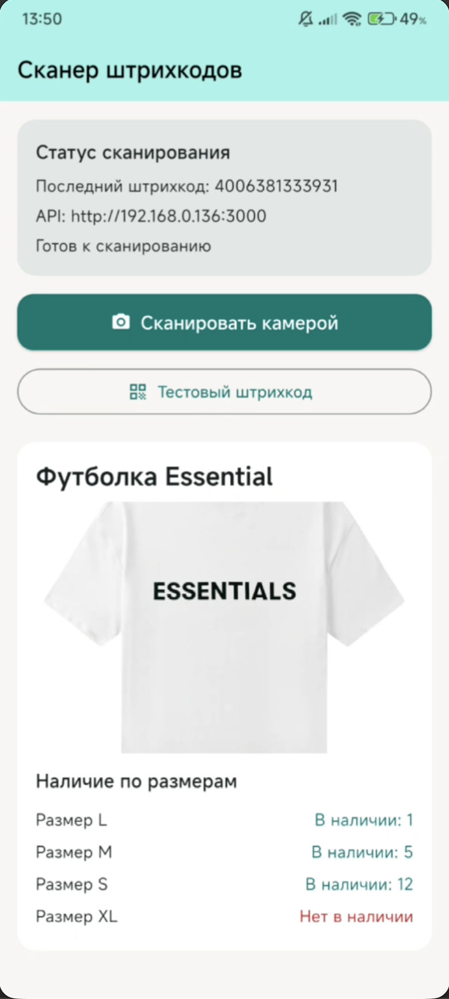

# Превью проекта

Ссылка: [video.mp4](resources/video.mp4)

## Описание

Штрихкод сканнер для мобильных устройств на Flutter/Dart с использованием библиотеки состояния riverpod и библиотеки для сканирования штрихкодов.

## Сервер

Сервер на NestJS с использованием библиотеки для работы с базами данных SQLite.

## Режимы работы

В приложении есть два режима работы:

- emulator (Для работы с эмулятором)
- localNetwork (Для работы с локальной сетью)

Их можно изменить в файле [lib/core/config/app_config.dart](lib/core/config/app_config.dart).
